# fuck-jxf

> **⚠️ 强烈不建议使用。本项目仅供学习与技术研究，请勿用于真实考勤打卡。**
> 详见下方「免责声明」。

针对 `jlujxf.com` 小程序的一次技术研究记录：
如何分析其登录流程、识别算术验证码、并以 CI 定时任务的形式复现请求。

内容涵盖 HTTP 抓包分析、验证码 OCR、GitHub Actions 定时任务等知识点。

---

## 目录

- [免责声明](#️-免责声明)
- [一、GitHub Actions 定时执行](#一github-actions-定时执行)
  - [1. Fork 本仓库](#1-fork-本仓库)
  - [2. 启用 Actions（关键，容易漏）](#2-启用-actions关键容易漏)
  - [3. 配置 Secrets](#3-配置-secrets)
  - [4. 触发时间](#4-触发时间)
  - [5. 手动触发](#5-手动触发)
  - [6. 查看结果](#6-查看结果)
  - [7. 保活（keepalive）](#7-保活keepalive)
  - [8. 上游有更新时，同步到你的 fork](#8-上游有更新时同步到你的-fork)
- [二、本地运行](#二本地运行)
- [配置项](#配置项)
- [文件说明](#文件说明)
- [常见问题](#常见问题)
- [反馈与贡献](#反馈与贡献)
- [许可证](#许可证)

---

## ⚠️ 免责声明

### 强烈不建议使用本项目。仅供学习与技术研究。

本项目是一份**技术研究记录**，用于学习 HTTP 协议分析、验证码 OCR 识别、
CI/CD 定时任务等知识点。**它不应该被运行，尤其不应该被用来完成真实的考勤打卡。**

**请不要使用本项目。** 如果你正在考虑用它替代手动签到，请先读完下面这段：

- 自动打卡本质上是**规避考勤管理**。无论技术上看是否可行，它都可能违反你所在
  学校或单位的规章制度，并可能导致**纪律处分、成绩认定问题或其他你并不想承担的后果**。
- 考勤系统的存在有其管理目的。用脚本绕过它，风险由**你本人**承担，而不是由本项目承担。
- 即使只用于你自己的账号，上述风险依然存在。「没影响别人」不等于「没有后果」。

其他限制：

- 本项目**仅限用于你本人拥有且有权访问的账号**，严禁用于任何他人账号或系统。
- 严禁用于商业用途、批量刷签、代他人签到或任何绕过考勤管理的行为。
- 严禁将本项目用于任何未授权的安全测试或渗透行为。
- 使用者应自行承担使用本项目所产生的一切后果，包括但不限于因违反所在学校/单位
  的规章制度、服务条款或相关法律法规而产生的责任。
- 本项目作者**不对任何滥用行为负责**，也不对使用本项目造成的任何直接或间接损失负责。
- 如果你不是相关系统的授权使用者，请立即停止使用并删除本项目。

**使用本项目即表示你已阅读、理解并自愿承担上述全部风险与责任。**

> **关于技术发现的说明**：本项目的技术实现完全基于对公开可访问接口的实测行为。
> 在开发过程中发现该后端存在若干安全缺陷（如 `/getInfo` 接口回传密码哈希、
> 接口无签名、验证码为简单算术题等）。这些发现**不构成对目标系统进行未授权测试的理由**，
> 也不代表本项目鼓励任何人去利用它们。如需报告安全问题，请通过正规渠道联系系统所有者。
>
> 本项目公开的目的，是作为「一个缺乏防自动化设计的后端能被怎样分析」的**反面教材**，
> 而不是提供一件可用的工具。

---

## 一、GitHub Actions 定时执行

### 1. Fork 本仓库

点击本仓库右上角的 **Fork**，把它复制到你自己的账号下。

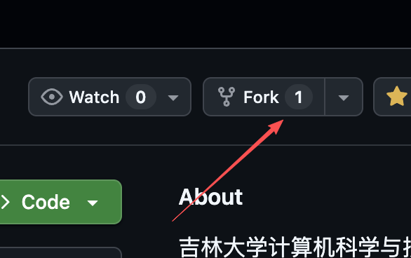

在跳转的页面确认仓库名后点 **Create fork**：

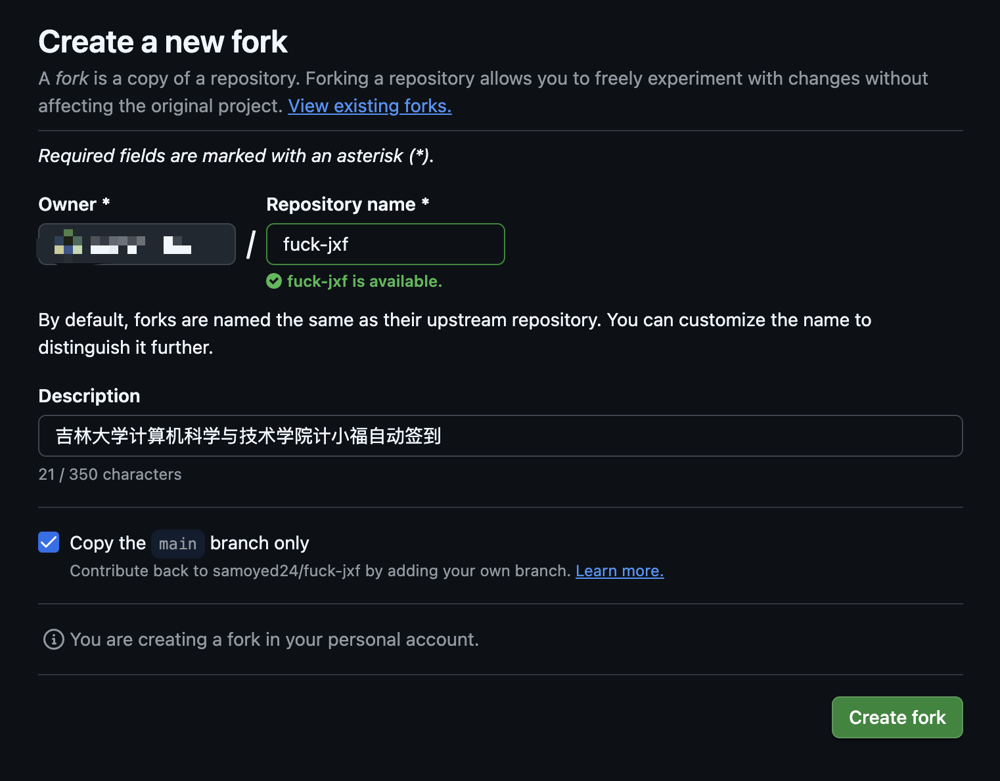

> **为什么必须 Fork，而不是直接用本仓库？**
> 定时任务需要读取 `JXF_USERNAME` / `JXF_PASSWORD` 两个 secrets，
> 而 secrets 只能配置在**你自己拥有写权限的仓库**里。
> 你没有本仓库的写权限，因此无法在本仓库配置 secrets。

### 2. 启用 Actions（关键，容易漏）

Fork 之后，GitHub **默认不运行 fork 仓库里的 workflow**，定时任务不会执行。
进入你 fork 出来的仓库，点 **Actions** 标签页，点击
**I understand my workflows, go ahead and enable them**。

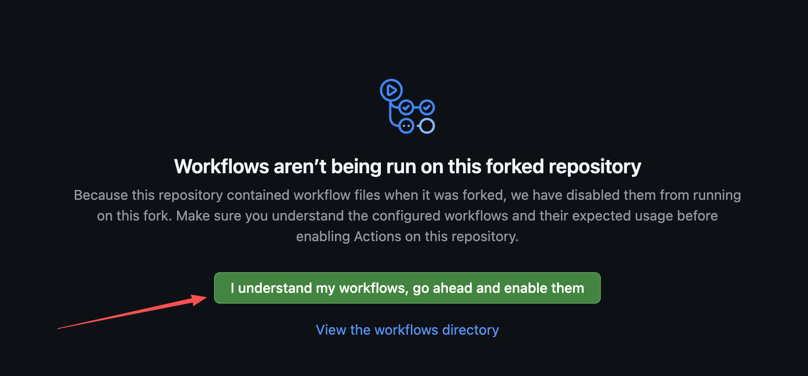

> 这是 GitHub 的官方行为：*"Workflows don't run in forked repositories by default."*
> 参考 [Events that trigger workflows](https://docs.github.com/en/actions/reference/workflows-and-actions/events-that-trigger-workflows)。

**两个 workflow 都需要单独启用。** 启用 Actions 后，点进每个 workflow，
若顶部出现黄色横幅，点击右侧 **Enable workflow**：

签到任务：

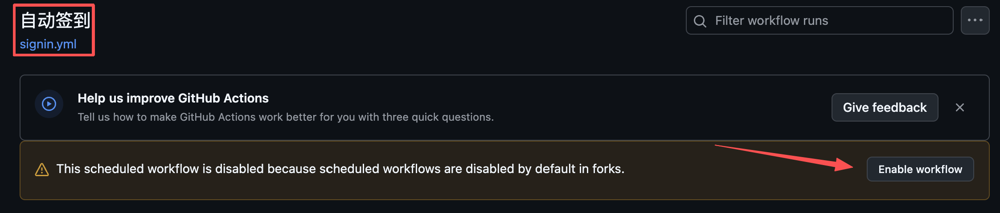

保活任务：

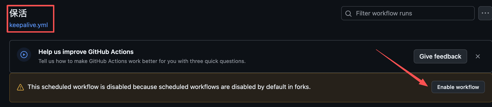

启用后建议先手动执行一次以确认配置无误（见下文「手动触发」）。

### 3. 配置 Secrets

进入**你 fork 的仓库**，点
**Settings → Secrets and variables → Actions → New repository secret**：

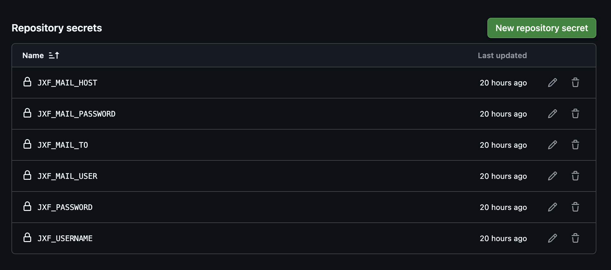

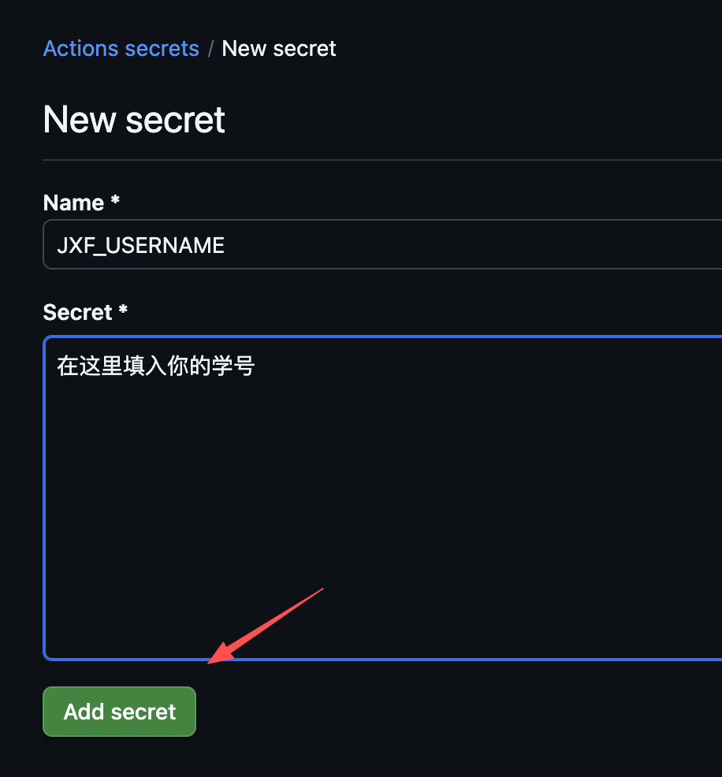

填写名称与值，点 **Add secret**：

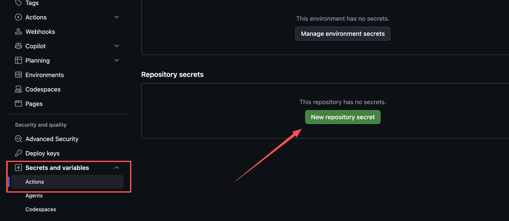

按下面的清单逐个添加：

**必填**

| Secret 名称 | 说明 |
|---|---|
| `JXF_USERNAME` | 登录账号（学号） |
| `JXF_PASSWORD` | 登录密码 |

**可选：通知开关**（与通道无关，控制「何时通知」）

| Secret 名称 | 默认 | 说明 |
|---|---|---|
| `JXF_NOTIFY_SUCCESS` | `true` | 签到成功时是否通知 |
| `JXF_NOTIFY_FAILURE` | `true` | 签到失败时是否通知 |

布尔值接受 `true/false`、`yes/no`、`1/0`、`on/off`（不区分大小写）。
**写错会直接报错退出**，不会静默取默认值。

> **默认成功和失败均发送通知。** 成功通知同时充当**心跳信号** ——
> 若某周未收到，说明任务未执行（如 workflow 被停用、凭据失效），
> 相比仅发送失败通知，更易察觉此类静默故障。
>
> 若不需要成功通知，可将 `JXF_NOTIFY_SUCCESS` 设为 `false`。

**可选：通知通道 1 —— Portcloud Notify（推荐）**

自己配置 SMTP 服务器比较麻烦（要开服务、申请授权码、处理各种服务商的
限制），建议直接用这个现成的托管服务。免费，几步就能用起来。

**使用前需要先给该服务的 GitHub 仓库点一个 Star** —— 服务端会校验你的
GitHub 账号是否已 Star，否则调用返回 `403 STAR_REQUIRED`。

登录控制台后，页面会提示需要 Star 并给出仓库链接（未 Star 时界面上会有
「去 Star」的引导按钮），按提示操作即可。仓库页面的 Star 按钮：

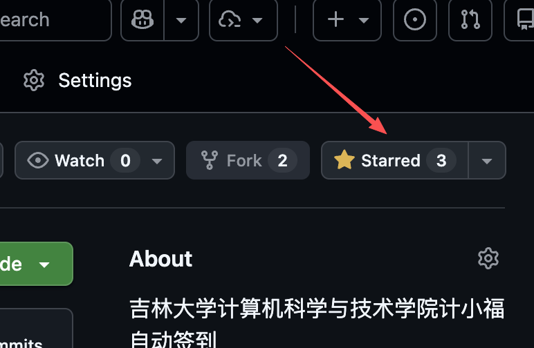

配置步骤：

**1.** 用 GitHub 登录 [notify.portcloud.online](https://notify.portcloud.online) 控制台

**2.** 在 **接收邮箱** 中添加收件邮箱并完成验证：

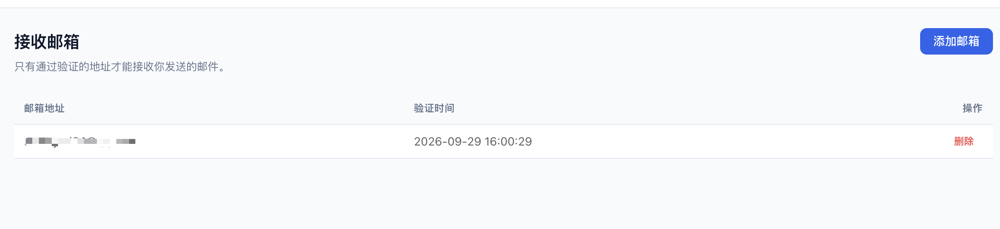

> 只有通过验证的地址才能接收邮件。

**3.** 在 **API Key** 中创建 Key：

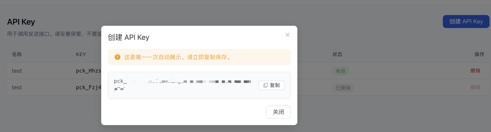

> 明文**只展示一次**，请立即复制保存。

**4.** 填入以下 secrets：

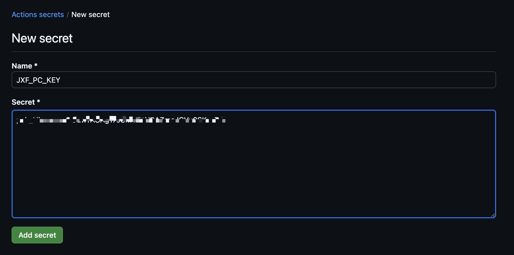

| Secret 名称 | 说明 |
|---|---|
| `JXF_PC_KEY` | API Key，形如 `pck_xxx` |
| `JXF_PC_TO` | 收件邮箱（须与上一步验证过的地址一致） |
| `JXF_PC_URL` | API 地址，默认 `https://notify.portcloud.online`，一般不用填 |

**可选：通知通道 2 —— SMTP 邮件**

适合已有邮箱、且不想依赖第三方服务的场景。需**同时配置**下面四项，
缺一不可（配置不完整会直接报错退出）：

| Secret 名称 | 说明 |
|---|---|
| `JXF_MAIL_HOST` | SMTP 服务器，如 `smtp.qq.com`、`smtp.163.com` |
| `JXF_MAIL_USER` | 发件邮箱 |
| `JXF_MAIL_PASSWORD` | 邮箱**授权码**（不是登录密码） |
| `JXF_MAIL_TO` | 收件邮箱 |
| `JXF_MAIL_PORT` | SMTP 端口，默认 `465`（SSL） |

**授权码怎么拿**：以 QQ 邮箱为例，设置 → 账户 → 开启 SMTP 服务 →
生成授权码。163 邮箱类似。**注意授权码不是邮箱登录密码。**

**两个通道可同时启用**，通知会同时投递到两者。都不配置则仅输出日志。

> **坐标无需配置。** 脚本会自动复用最近一次成功签到的坐标，
> 以保证每次提交的位置完全一致。
> **若该账号从未签到过，脚本会报错退出** —— 请先在小程序里手动签到一次。

> 再次提醒：以下步骤仅作为技术流程说明记录，**不代表建议你去执行**。

### 4. 触发时间

已配置为 **每周一北京时间 09:00**（UTC 周一 01:00）自动执行：

```yaml
on:
  schedule:
    - cron: '0 1 * * 1'   # UTC 周一 01:00 = 北京周一 09:00
```

> **GitHub Actions 的 cron 使用 UTC 时区。**
> 另外，定时任务在平台高负载时可能延迟数分钟至一小时，属正常现象。

#### 想改打卡时间？

打卡时间**不支持用 Secrets 或环境变量配置，需要自己改代码后提交**。

1. 把仓库 clone 到本地（或直接在 GitHub 网页上编辑）
2. 修改 `.github/workflows/signin.yml` 里的 cron 表达式
3. 提交并推送到默认分支

**北京时间 = UTC + 8**，所以 `北京 09:00` 要写成 `UTC 01:00`：

```yaml
- cron: '0 1 * * 1'      # 周一 09:00 北京（默认）
- cron: '0 10 * * 1'     # 周一 18:00 北京
- cron: '0 1 * * *'      # 每天 09:00 北京
- cron: '0 1 * * 1,3,5'  # 周一/三/五 09:00 北京
```

### 5. 手动触发

**Actions → 自动签到 → Run workflow**，可勾选「只走流程不实际提交」
（对应 `--dry-run`）先验证配置：

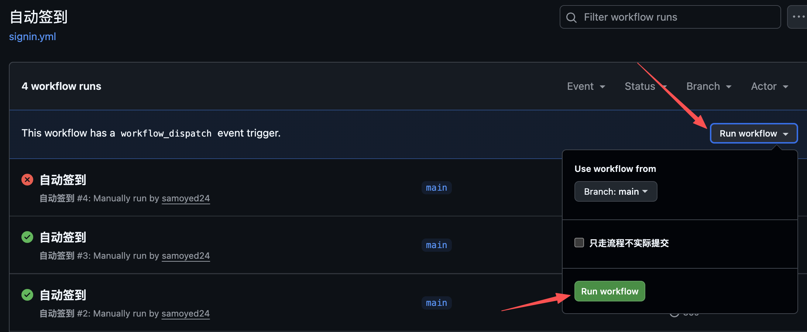

### 6. 查看结果

每次运行的结果会写入 **Actions 运行详情页的 Summary**（签到日志最后 20 行）。
点开某次运行即可看到完整日志：

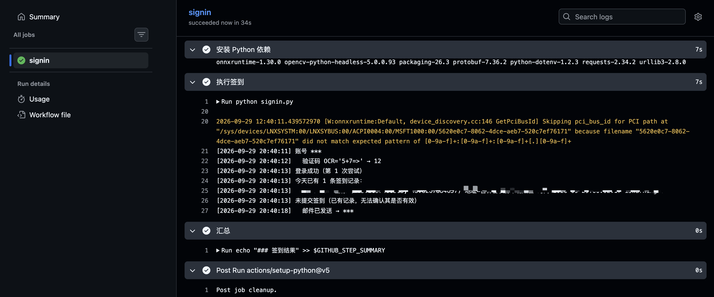

### 7. 保活（keepalive）

GitHub 会在仓库 60 天没有活动时自动停用定时任务。签到仓库平时不会有
commit，所以会触发这条规则。

仓库内的 `.github/workflows/keepalive.yml` 会**每 30 天自动提交一次
commit**，让仓库保持活动状态，避免定时任务被停用。

> Fork 后请确认 `keepalive.yml` 也处于启用状态。

### 8. 上游有更新时，同步到你的 fork

Fork 之后，本仓库的更新**不会自动同步**到你的 fork。想用上新版本，
需要手动同步一次。

#### 方法一：网页操作（推荐）

进入**你 fork 的仓库**首页，仓库名下方会显示与上游的差异，
例如 *"This branch is 3 commits behind samoyed24:main"*。
点击右侧的 **Sync fork** 下拉菜单，再点 **Update branch**：

```
┌─────────────────────────────────────────────┐
│  This branch is 3 commits behind ...        │
│                          [ Sync fork ▾ ]    │
└─────────────────────────────────────────────┘
```

同步后再确认 workflow 是否仍处于启用状态（见第 2 节）——
有时同步会重置该状态。

#### 方法二：命令行

```bash
cd fuck-jxf

# 首次需要添加上游仓库（只需做一次）
git remote add upstream https://github.com/samoyed24/fuck-jxf.git

# 拉取上游更新并合并
git fetch upstream
git checkout main
git merge upstream/main

# 推送到你自己的 fork
git push origin main
```

#### ⚠️ 如果你改过打卡时间

第 4 节提到，修改打卡时间需要编辑 `.github/workflows/signin.yml` 里的
cron 表达式。**一旦你改过，同步时就可能产生冲突** —— 因为上游的同名
文件也有改动，Git 无法自动决定保留哪份。

网页端此时会给出多个选项，**不要点 "Discard commits"** ——
那会丢弃你的全部本地提交，改动无法找回：

| 选项 | 含义 |
|---|---|
| **Update branch** | 能自动合并时出现，正常同步 |
| **Discard N commits** | ⚠️ **丢弃你的改动**，慎点 |
| **Open pull request** | 有冲突时出现，走 PR 流程手动解决 |

**方式 A：放弃自己的改动**（最省事）

若只是改了打卡时间，可以直接接受上游版本，同步后**重新改一次**。
不建议点 "Discard commits"（会丢全部提交），更稳的做法是命令行操作：

```bash
git fetch upstream
git checkout main
git reset --hard upstream/main    # 丢弃本地全部改动
git push --force origin main
```

**方式 B：保留自己的改动**（命令行）

```bash
git fetch upstream
git merge upstream/main
# 若提示 signin.yml 冲突，手动编辑该文件解决
# 解决后：
git add .github/workflows/signin.yml
git commit
git push origin main
```

> 建议：如果只是想改时间，改完后在 commit message 里写清楚，
> 下次同步时更容易识别出是哪处改动导致的冲突。

---

## 二、本地运行

```bash
cd ~/dev/fuck-jxf

# 1. 配置凭据
cp .env.example .env
vim .env                       # 填入学号、密码

# 2. 运行
.venv/bin/python signin.py
```

`.env` 已被 gitignore，不会提交。首次使用需先建虚拟环境：

```bash
uv venv --python 3.12
uv pip install -r requirements.txt
```

### 命令行参数

```bash
python signin.py            # 签到
python signin.py --check    # 只查状态，不签到
python signin.py --dry-run  # 走完整流程但不提交
python signin.py --force    # 今天已有记录时仍强制提交一次
```

**退出码只表示脚本自身是否执行成功，不表示签到结果。**

| 情况 | 退出码 | 通知 |
|---|---|---|
| 签到成功 | 0 | 成功 |
| 当天已有记录，未提交 | 0 | **失败** |
| 服务端拒绝签到 | 0 | **失败** |
| 登录失败 | 1 | 失败 |
| 取不到坐标 | 1 | 失败 |

签到结果通过**邮件通知**传达，因此 CI 不会因业务失败而显示红色 ——
需要关注的是邮件内容，而非 Actions 的运行状态。

**若当天已有签到记录，脚本不会重复提交**，并发送失败通知。
原因：脚本未执行签到动作，且已有记录是否被系统正常认定无法通过接口判定，
需人工核实。确认无误后如需强制再提交，加 `--force`。

> 需要定时执行请使用 GitHub Actions（见上文），无需本地常驻进程。

---

## 配置项

本地写在 `.env`，CI 里配在 GitHub Secrets —— **变量名完全一致**，
所以本地验证通过即代表 CI 可正常运行。

**必填**

| 变量 | 说明 |
|---|---|
| `JXF_USERNAME` | 登录账号（学号） |
| `JXF_PASSWORD` | 登录密码 |

**可选：通知开关**（与通道无关）

| 变量 | 默认 | 说明 |
|---|---|---|
| `JXF_NOTIFY_SUCCESS` | `true` | 成功时是否通知 |
| `JXF_NOTIFY_FAILURE` | `true` | 失败时是否通知 |

> 旧名 `JXF_MAIL_NOTIFY_SUCCESS` / `JXF_MAIL_NOTIFY_FAILURE` 仍兼容，
> 但新名优先。

**可选：通道 1 —— Portcloud Notify（推荐）**

需先给该服务的 GitHub 仓库点 Star（控制台内会给出链接），
否则返回 `403 STAR_REQUIRED`。

| 变量 | 默认 | 说明 |
|---|---|---|
| `JXF_PC_KEY` | — | API Key，形如 `pck_xxx` |
| `JXF_PC_TO` | — | 收件邮箱（需预先验证） |
| `JXF_PC_URL` | `https://notify.portcloud.online` | API 地址 |

**可选：通道 2 —— SMTP 邮件**

| 变量 | 默认 | 说明 |
|---|---|---|
| `JXF_MAIL_HOST` | — | SMTP 服务器 |
| `JXF_MAIL_USER` | — | 发件邮箱 |
| `JXF_MAIL_PASSWORD` | — | 邮箱授权码 |
| `JXF_MAIL_TO` | — | 收件邮箱 |
| `JXF_MAIL_PORT` | `465` | SMTP 端口（SSL） |

两个通道可同时启用。都不配置则仅输出日志。

坐标**不需要配置**，脚本自动复用最近一次成功签到的坐标。

环境变量的优先级高于 `.env` 文件。

---

## 文件说明

| 文件 | 说明 |
|---|---|
| `signin.py` | 主程序 |
| `.env.example` | 凭据模板（`cp .env.example .env` 后填写） |
| `.env` | 你的凭据（已被 gitignore） |
| `requirements.txt` | Python 依赖 |
| `.github/workflows/signin.yml` | 定时签到（每周一北京时间 09:00） |
| `.github/workflows/keepalive.yml` | 保活，防定时任务被自动停用（每月 1 日） |
| `signin.log` | 运行日志（已被 gitignore） |
| `.keepalive` | 保活时间戳，由 keepalive.yml 自动更新 |
| `LICENSE` | WTFPL v2 |
| `docs/` | README 中引用的操作截图 |

---

## 常见问题

**Q: Actions 里报 `缺少凭据`？**
A: 检查 secrets 名称是否为 `JXF_USERNAME` / `JXF_PASSWORD`，注意大小写。

**Q: 报 `libGL.so.1: cannot open shared object file`？**
A: workflow 里已包含 `apt-get install libgl1 libglib2.0-0`，若仍报错请检查该步骤是否执行成功。

**Q: 定时任务没按时执行？**
A: 按可能性排查：
1. **workflow 被自动停用**（最常见）—— 去 Actions 页面看是否有 disabled 横幅，点 Enable 恢复。详见上文「7. 保活」。
2. **Fork 仓库的 Actions 未启用** —— 见上文「2. 启用 Actions」。
3. **cron 延迟** —— GitHub Actions 在平台高负载时会延迟，通常数分钟内，偶尔更久。这是平台特性，无法从代码层面解决。

**Q: 没收到通知邮件？**
A: 依次检查：
1. 四个必填项（HOST/USER/PASSWORD/TO）是否都配了 —— **一个都没配时不会发邮件**，
   缺一部分则直接报错
2. `JXF_MAIL_PASSWORD` 填的是**授权码**还是登录密码 —— 必须是授权码
3. 收件箱的垃圾邮件目录
4. Actions 日志里搜「邮件」看是否有发送失败的提示

> 反之，**若此前持续收到成功邮件、其后中断**，说明任务未在执行 ——
> 请检查 Actions 页面中 workflow 是否被停用。这是成功邮件的一项附加价值。

**Q: 收到「今天已有记录，未提交」的失败通知？**
A: 这是预检查生效，不是故障。脚本发现当天已有签到记录，因此没有重复提交 ——
但无法确认那条记录是否被系统正常认定，故发送失败通知而非静默跳过。
（Actions 页面不会显示失败，因为脚本本身执行成功了。）

处理方式：
1. 去小程序确认当天是否已正常签到 —— 是则忽略该通知
2. 若确认记录无效，用 `--force` 强制再提交一次

> 默认每周定时执行时不会遇到此情况。若频繁出现，说明当天被重复触发
> （如同时配置了本地 launchd 和 GitHub Actions）。

**Q: 验证码识别失败？**
A: 脚本默认重试 6 次（每次重新获取验证码）。若持续失败，可能是验证码机制变更，需要调整 OCR 逻辑。

---

## 反馈与贡献

- **发现 BUG** —— 欢迎通过 [Issue](https://github.com/samoyed24/fuck-jxf/issues) 汇报，
  请附上运行日志（`signin.log` 或 Actions 的 Summary）以便定位。
- **贡献代码** —— 欢迎通过 [Pull Request](https://github.com/samoyed24/fuck-jxf/pulls) 提交。

> 汇报前请先确认问题可复现，并**移除日志中的账号、密码、坐标等个人信息**。

---

## 许可证

[WTFPL v2](LICENSE) —— Do What The Fuck You Want To Public License。
